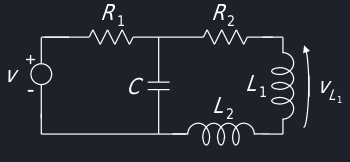

# Modellistica dei sistemi elettrici
## Introduzione
Nel corso ci si limita a sistemi elettrici semplici planari con:

- Resistori ideali, componente passivo con equazione costitutiva $v_R(t) = R i_R(t)$
- Condensatori ideali, compontente passivo con equazione costitutiva $i_C(t)  = C \frac{dv_c(t)}{dt}$
- Induttori ideali, componente passivo con equazione costitutiva $v_L(t) = L\frac{di_L(t)}{dt}$
- Generatore ideale di tensione
- Generatore ideale di corrente

Negli elementi passivi viene usata la convenzione dell'utilizzatore, mentre nei generatori viene usata la convenzione del generatore.

## Rappresentazione in variabili di stato
I passaggi da seguire per rappresentare il sistema in variabili di stato sono:

1. Scrivere le **equazioni costitutive** per condensatori ed induttori.
2. Descrivere **nodi e maglie** tramite leggi di Kirchoff.
3. Introdurre le **variabili di stato** che rappresentano la tensione applicata ai condensatori e la corrennte che scorre negli induttori.
4. Individuare le **varibili di ingresso** di ogni generatore ideale.
5. Infine si ricavano le **equazioni di stato** e di **uscita del sistema**.

### Esempio

In questo esempio seguirò i passaggi numerati descritti nella sezione precedente. Dato il sistema:

1. Le equazioni costitutive sono $v_L(t) = L \frac{di_L(t)}{dt}$ e $i_C(t) = C \frac{dv_C(t)}{dt} =  \frac{dv_2(t)}{dt}$. [^1]
2. L'equazione alla maglia del sistema è $v(t) = v_1(t) + v_L(t) + v_2(t)$, mentre l'equazione al nodo è $i_L(t) + i(t) = i_2(t) + i_C(t)$, prendendo in considerazione il morsetto positivo di $R_2$.
3. Le variabili di stato del sistema sono quindi $x(t) = \begin{bmatrix}x_1(t)\\x_2(t)\end{bmatrix} = \begin{bmatrix}i_L(t)\\v_2(t)\end{bmatrix}$
4. Gli ingressi invece sono dati dai generatori e quindi $u(t) = \begin{bmatrix}u_1(t)\\u_2(t)\end{bmatrix} = \begin{bmatrix}v(t)\\i(t)\end{bmatrix}$

Le equazioni di costitutive e topologiche da usare sono quindi:

- $v_L(t) = L\frac{di_L(t)}{dt}$
- $i_c(t) = C \frac{dv_2(t)}{dt}$
- $v(t) = v_1(t) + v_L(t) + v_2(t)$
- $_L(t) + i(t) = i_2(t) + i_c(t)$

Mentre le variabili di stato e ingresso sono:

- $x(t) = \begin{bmatrix}x_1(t)\\x_2(t)\end{bmatrix} = \begin{bmatrix}i_L(t)\\v_2(t)\end{bmatrix}$
- $u(t) = \begin{bmatrix}u_1(t)\\u_2(t)\end{bmatrix} = \begin{bmatrix}v(t)\\i(t)\end{bmatrix}$

Possiamo quindi continuare col procedimento:

5. Per l'individuazione delle **equazioni di stato** dei componenti con memoria, partiamo dalla derivata di $x_1$, ovvero $\dot{x}_1 = \frac{di_L}{dt} = \frac{v_L}{L}$. L'obbiettivo e raggiungere una forma in cui $\dot{x}_1$ dipende solo dalle variabili di **stato** ($x_i$) ed **ingresso** ($u_i$), quindi utilizzando la legge topologica sui nodi $\frac{v_L}{L} = \frac{(v - v_1 - v_2)}{L} = \frac{(u_1 - v_1 - x_2)}{L}$. Infine, utilizzando le leggi topologiche sulla maglia si può scrivere $v_1 = R_1 i_L$, dunque $\dot{x}_1 = f_1(t, x, u) = -\frac{R_1}{L} x_1 -\frac{1}{L} x_2 + \frac{1}{L} u_1$. Con ragionamenti simili si ha che $\dot{x_2} = \frac{dv_2}{dt} = \frac{i_C}{C} = \frac{(i_L + i - i_2)}{C} = \frac{(x_1 + u_2 - i_2)}{C} = \frac{1}{C} x_1 + \frac{u_2}{C} u_2 - \frac{v_2}{CR_2} = \frac{1}{C} x_1 + \frac{u_2}{C} u_2 - \frac{1}{CR_2} x_2$.
6. Per ricavare le **equazioni di uscita** del sistema si parte da $y_1 = v_1$, e seguendo passaggi e obbiettivi uguali a quelli nel punto 5 $v_1 = R_1 i_L = R_1 x_1 = g_1(t, x, u)$. Per la seconda equazione di uscita $y_2 = v_2 = x_2 = g_2(t, x, u)$.

Si può dunque dire che il sistema è dinamico, MIMO (Multiple In Multiple Out), a tempo continuo[^2], con dimensioni finite[^3] $n = 2$ e proprio[^4].

Se $R_1$, $R_2$, L e C sono costanti, allora si ha che il sistema è LTI

Scrivendo quindi $\dot{X}$ come $\dot{X} = Ax(t) + Bu(t)$, dove A e B sono matrici costanti, si può individuare che:

|  | $x_1$ | $x_2$ | $u_1$ | $u_2$ |
| ---- | --- | --- | --- | --- |
| $\dot{x}_1$ | $-\frac{R_1}{L}$ | $-\frac{1}{L}$ | $\frac{1}{L}$ | 0 |
| $\dot{x}_2$ | $\frac{1}{C}$ | $-\frac{1}{R_2 C}$ | 0 | $\frac{1}{C}$ |
 
Applicando lo stesso concetto ad $y(t) = Cx(t) + Du(t)$ si ha che:

|  | $x_1$ | $x_2$ | $u_1$ | $u_2$ |
| ---- | --- | --- | --- | --- |
| $y_1$ | $R_1$ | 0 | 0 | 0 |
| $y_2$ | 0 | 1 | 0 | 0 |

Dunque le costanti del sistema sono:

- $A = \begin{bmatrix}-\frac{R_1}{L} & -\frac{1}{L}\\\frac{1}{C} & -\frac{1}{R_2 C}\end{bmatrix}$
- $B = \begin{bmatrix}\frac{1}{L}&0\\0&\frac{1}{C}\end{bmatrix}$
- $C = \begin{bmatrix}R_1&0\\0&1\end{bmatrix}$
- $D = \begin{bmatrix}0&0\\0&0\end{bmatrix}$

### Esempio

Scrivo le equazioni costitutive e topologiche:

- $i_C(t) = C\frac{dv_C(t)}{dt}$
- $v_{L_1}(t) = L\frac{di_{L1}(t)}{dt} = L\frac{di_{2}(t)}{dt}$
- $v_{L_2}(t) = L\frac{di_{L2}(t)}{dt} = L\frac{di_{2}(t)}{dt}$
- $v(t) = v_1(t) + v_C(t)$
- $v_C(t) = v_2(t) + v_{L_1}(t) + v_{L_2}(t)$
- $i_1(t) = i_C(t) + i_2(t)$

Da notare che $i_{L_1} = i_{L_2} = i_2$. Inoltre per la scelta delle variabili di stato bisogna considerare solamente le variabili indipendenti, dunque il vettore $x_t$ conterrà $i_2$ invece di $i_{L_k}$.

- $x(t) = \begin{bmatrix}x_1(t)\\x_2(t)\end{bmatrix} = \begin{bmatrix}v_C(t)\\i_2(t)\end{bmatrix}$
- $u(t)$ viene data dal problema ed è pari a $u(t) = \begin{bmatrix}v(t)\end{bmatrix}$

Scrivo le equazioni di stato:

DA COMPLETARE

Scrivo l'equazione di uscita:

$y = V_{L_1} = L_1 \frac{dI_2(t)}{dt} = L_1 \dot{x_2} = L_1f_2(t, x, u) = \frac{L_1}{L_1 + L_2}x_1 - \frac{L_1R_2}{L_1+L_2}x_2$

Questo è un caso di **rete elettrica degenere**, ovvero una rete che contiene:

- Una maglia con solo condensatori e/o generatori di tensione
- Un taglio (lato) costituito solo da induttori e/o generatori di corrente.

In queste reti il numero di variabili di stato è ^^strettamente inferiore^^ del numero di componenti reattivi, in quanto questi hanno componenti linearmente dipendenti.

[^1]: Dato che C e $R_2$ sono in parallelo, la tensione ai capi di C è anche la tensione ai capi di $R_2$, quindi $v_C = v_2$
[^2]: Le equazioni di stato hanno la forma delle differenziali piuttosto delle equazioni agli estremi.
[^3]: Numero delle equazioni di stato.
[^4]: Non compare esplicitamente u nelle equazioni di uscita.