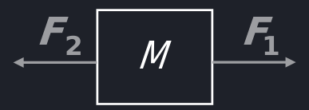
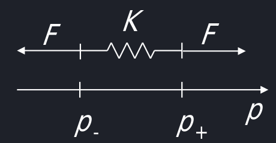
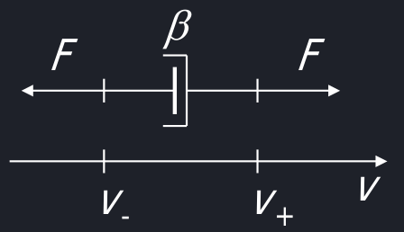
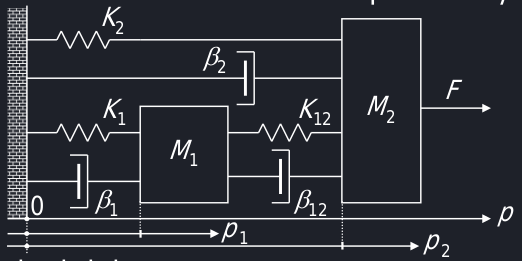

# Modellistica di sistemi meccanici

I sistemi meccanici sono composti da tre elementi: traslazione, molla ideale e smorzatore ideale (come quelli elettrici sono formati da R, L e C).
## Sistemi meccanici in traslazione

Si considera in traslazione un corpo puntiforme di massa M che scivola su un piano orizzontale (O eventualmente verticale). Per la seconda legge di neton la forza di inerzia del corpo $M\ddot{p}(t) = M\frac{d^2p(t)}{dt^2} = F(t) = \Sigma_i F_i(t)$ in cui $F_i$ sono le forze esterne agenti sul corpo.

Questa equazione è una differenziale del secondo ordine e andranno trasformate in equazioni differenziali del primo ordine.
## Molla ideale
{ align=left }

La forza elastica della molla è data da $F(t) = K[p_+(t) - p_(t)]$, dove $p_k$ indica la sua posizione da allungata degli estremi. Agli estremi di una molla si vanno sempre a creare due fore uguali e opposte di modulo F. Quindi la forza elastica è proporzionale allo spostamento relativo dei due estremi.
## Smorzatore ideale

La forza di attrito dovuta allo smorzatore vale $F(t) = \beta[v_+(t)-v_(t)] = \beta[\dot{p}_+(t) - \dot{p}_-(t)]$. Questa forza è proporzionale alla velocità relativa degli elementi che lo compongono.

## Equazioni del moto per sistemi in traslazione
Per le equazioni del moto si ritorna all'equazione di newton:

$M_i \ddot{p}_i(t) = \Sigma_kF_k^{est}(t) - \Sigma_j^{j \neq i}F_{ij}^{int}(t)$

Le **forze esterne** tengono conto dell'azione del mondo esterno sull'elemento $M_i$, mentre le forze interne dipende dai tipi di collegamento tra gli elementi che compongono il sistema (ad esempio collegamento tra massa e smorzatore).

- Per molle ideali $F_{ij}^{int}(t) = K_{ij}[p_i(t)-p_j(t)]$
- Per smorzatori ideali $F_{ij}^{int}(t) = \beta_{ij}[\dot{p_i}(t)-\dot{p_j}(t)]$

!!! note "Appunto su $\dot{p}$"

    Se p è la posizione, $\dot{p}$ è velocità. Mentre le molle dipendono dalla posizione, gli smorzatori dipendono dalla velocità.

## Rappresentazioni in variabili di stato
I passaggi sono simili ai sistemi elettrici:

1. Scrivere **tutte** le equazioni del moto, sia per i corpi che hanno massa ché per quelli che non hanno una massa ma hanno una posizione ed una velocità (i punti materiali). Per farlo sarà necessario trasformare tutte le differenziali del secondo ordine in primo ordine.
2. Introdurre le **variabili di stato** per ogni punto  scegliendo posizione $p_i$ e $\dot{p_i}$.
3. Scrivere le **variabili d'ingresso** che rappresentano le forze esterne che muovono il sistema. Queste normalmente variano nel tempo. Se quel contributo è costante non lo vado a mettere nelle variabili di ingresso, in quanto non cambia ed è un'informazione in meno da computare.
4. Si ricavano le equazioni di stato come $\dot{x}_i(t) = \frac{dx_i(t)}{dt} = f_i(t, x(t), u(t))$
5. Ricavare le equazioni di uscita come $y_k(t) = g_k(t, x(t), u(t))$.

## Esempio
Ricavare la rappresentazione in variabili di stato del seguente sistema meccanico in traslazione, in cui le variabili di interesse sono le posizioni $p_1$ e $p_2$.

Scegliendo come punto di origine del sistema la parete a sinistra:

1. Equazioni del moto. Ci sono due masse quindi due equazioni del moto. Per $M_1$ si ha $M_1\ddot{p_1} = 0 - [K_1(p_1 - 0) + \beta_1(\dot{p_1}-0) + K_{12}(p_1 - p_2) + \beta_{12}(\dot{p_1} - \dot{p_2})]$ e per $M_2$ si ha $M_2\ddot{p_2}=F-[K_2(p_2 - 0) + \beta_2(\dot{p_2} - 0) + K_{12}(p_2 - p_1) + \beta_{12}(\dot{p_2} - \dot{p_1})]$. Da notare come la massa puntiforme sebbene è rappresentata come un quadrato non ha posizione nel baricentro ma in $p_1$.
2. Inserire le variabili di stato $x(t) = \begin{bmatrix}p_1(t)&p_2(t)&\dot{p_1}(t)&\dot{p_2}(t)\end{bmatrix}^T = \begin{bmatrix}x_1(t)&x_2(t) &x_3(t) &x_4(t)\end{bmatrix}^T$
3. Scrivere la variabile d'ingresso $u(t) = \begin{bmatrix}F(t)\end{bmatrix}$

Equazioni di stato:

- $\dot{x_1} = \frac{dp_1}{dt} = \dot{p_1} = x_3 = f_1(t, x, u)$.
- $\dot{x_2} = \frac{dp_2}{dt} = \dot{p_2} = x_4 = f_2(t, x, u)$.
- $\dot{x_3} = \dot{p_1} = -\frac{1}{M}[K_1 p_1+ \beta_1 \dot{p_1} + K_{12}(p_1 - p_2) + \beta_{12}(\dot{p_1} - \dot{p_2})]$ = $-\frac{K_1 + K_{12}}{M_1}x_1 + \frac{K_{12}}{M_1}x_2 - \frac{\beta_1 + \beta_{12}}{M_1}x_3 + \frac{\beta_{12}}{M_1}x_4 = f_3(t, x, u)$
- $\dot{x_4} = \frac{d\dot{p_2}}{dt} = \ddot{p_2} = \frac{F}{M_2} - \frac{1}{M}[K_2p_2 + \beta_2\dot{p_2} + K_{12}(p_2-p_1) + \beta_{12}(\dot{p_2} - \dot{p_1})]$ = $DA COMPLETARE SLIDE 19$

4. Equazioni di uscita sono $y_1 = x_1$ e $y_2 = x_2$.

Possiamo classificare il sistema come dinamico, a tempo continuo, MIMO, a dimensione finita (n = 4), proprio

!!! note "Attrito"
    
    Si può rappresentare l'attrito delle masse tramite uno smorzatore equivalente che frena il punto. In questo esempio gli smorzatori $\beta_1$ e $\beta_2$ rappresentano le forze di attrito di $M_1$ e $M_2$.