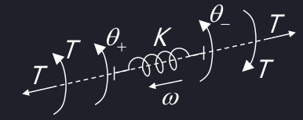
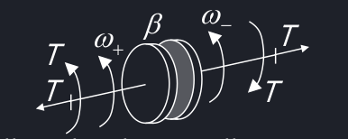
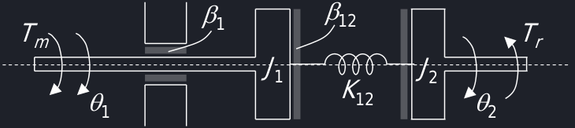
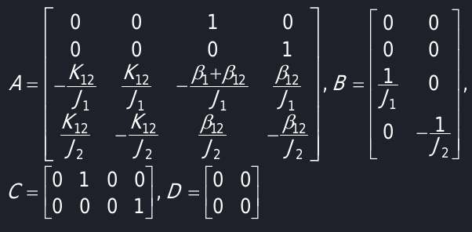

# Modellistica di sistemi meccanici in rotazione

Un corpo puntiforme in rotazione segue la seconda legge di newton $J\ddot{\theta}(t) = J\frac{d^2\theta(t)}{dt^2} = T(t)$. Le variabili importanti sono la posizione angolare $\theta$ e la velocità angolare $\omega$; J è definito momento d'inerzia e $J\ddot{\theta}(t)$ è definito *coppia d'inerzia*. Il sistema di riferimento standard vede la rotazione positiva nel senso in cui viene applicata la coppia di forze; se la coppia è in verso antiorario allora sarebbe meglio scegliere come positive le rotazioni antiorarie. Se il sistema presenta più coppie è necessario fare una scelta arbitraria.

Unità: [T] = N m, [$\theta$] = rad, [J] = kg $m^2$.

Per rappresentare in 2D una rotazione, si usa il vettore normale al piano di rotazione ottenuto tramite la regola della mano destra (antiorario verso sinistra, orario verso destra).

## Molla torsionale

Agli estremi della molla vi saranno due coppie torsionali uguali e opposte, date da $T(t) = K[\theta_+(t) - \theta_-(t)]$.

Unità: [T] = N m, [$\theta$] = rad, [K] = $\frac{N m}{rad}$
## Smorzatore

La coppia di attrito è dovuta alla velocità relativa dei due corpi. $T(t) = \beta[\omega_+(t) - \omega_-(t)] = \beta[\dot{\theta}_+(t) \dot{\theta}_-(t)]$

Unità: [T] = N m, [$\dot{\theta}$] = $\frac{rad}{s}$, [K] = $\frac{N m s}{rad}$
## Equazioni del moto
L'equazione del moto si ricava come $J_i\ddot{\theta}_i(t) = \Sigma_kT_k^{est}(t) - \Sigma_l^{l\neq i}T_{il}^{int}(t)$.
Le coppie interne tengono conto dell'interazione tra l'elemento $J_i$ e gli altri corpi tramite:

- Molle ideali ($T_{il}^{int} = K_{il}[\theta_i(t) - \theta_l(t)]$)
- Smorzatori ideali ($T_{il}^{int} = \beta_{il}[\dot{\theta}_i(t) - \dot{\theta}_l(t)]$)

## Modellistica
Passi:
 - Trova equazioni del moto
 - Trova variabili di stato
 - Associare le varibili d'ingresso alle coppie
 - Ricavare l'equazioni di stato del tipo $\dot{X}_i(t) = \frac{dx_i(t)}{dt} = f_i(t, x(t), u(t))$
 - Ricavare le equazioni di uscita $y_k(t) = g_k(t, x(t), u(t))$
  
### Esempio

Un albero motore è collegato ad una giunzione elastica smorzata e un carico (antenna parabolica).

!!!note "Giunzione Elastica Smorzata"
    
    La coppia JKJ è detta Giunsione elastica smorzata, o frizione.

Trovare le equazioni del moto, $J_1\ddot{\theta}_1 = T_m - [\beta_1(\dot{\theta}_1 - 0) + K_{12}(\theta_1 - \theta_2) + \beta_{12}(\dot{\theta}_1 - \dot{\theta}_2)]$ per l'albero motore e $J_2\ddot{\theta}_2 = T_r - [K_{12}(\theta_2 - \theta_1) + \beta_{12}(\dot{\theta}_2 - \dot{\theta}_1)]$ per il carico.

Trovare le variabili di stato, $x(t) = \begin{bmatrix}\theta_1(t)\\\theta_2(t)\\\dot{\theta_1}(t)\\\dot{\theta_2}(t)\end{bmatrix} = \begin{bmatrix}x_1(t)\\x_2(t)\\x_3(t)\\x_4(t)\end{bmatrix}$

Indicare le uscite, $u(t) = \begin{bmatrix}T_m(t)\\ T_r(t)\end{bmatrix} = \begin{bmatrix}u_1(t)\\u_2(t)\end{bmatrix}$

Trovare le equazioni di stato:

- $\dot{x_1} = \frac{d\theta_1}{dt} = \theta_1 = x_3$
- $\dot{x_2} = \frac{d\theta_2}{dt} = \theta_2 = x_4$
- $\dot{x_3} = \frac{d\dot{\theta_1}}{dt} = \ddot{\theta_1} = ...$ $= -\frac{K_{12}}{J_1} + \frac{K_{12}}{J_1} - \frac{\beta_1 + \beta_{12}}{J_1} + \frac{\beta_{12}}{J_1} + \frac{u_1}{J_1}$
- $\dot{x_4} = \frac{d\dot{\theta_2}}{dt} = \ddot{\theta_2} = ...$ $= \frac{K_{12}}{J_2} - \frac{K_{12}}{J_2} + \frac{\beta_{12}}{J_2} - \frac{\beta_{12}}{J_2} - \frac{u_2}{J_2}$

Trovare le uscite $y_1 = \theta_2 = x_2$ e $y_2 = \dot{\theta_2} = x_4$.

Se dico che $J_1$, $J_2$, $K_{12}$, $\beta_1$ e $\beta_{12}$ il sistema è LTI.

$\dot{x}(t) = Ax(t) + Bu(t)$ e $y(t) = Cx(t) + Du(t)$

Dato che D è nulla, allora il sistema è proprio.