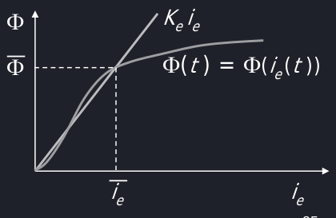
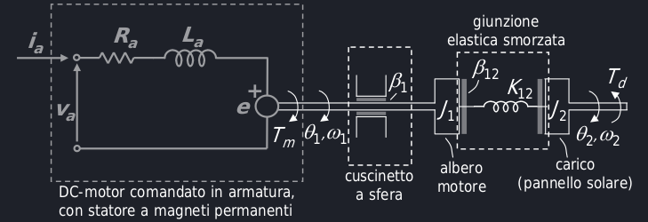

# Modellistica dei sistemi elettromeccanici
## CD-Moto con comando di eccitazione
La corrente di armatura del rotore è costante nel tempo $i_a(t) = \overline{i_a}$.
Quindi $v_a(t) = R_a\overline{i_a} + La\frac{d\overline{i_a}}{dt} + K\Phi(t)\omega(t) = R_a\overline{i_a}K\Phi(t)\omega(t)$, dove $\Phi$ è il flusso.
Le equazioni dinamiche si riducono a $v_e(t) = R_ei_e(t) + L_e\frac{di_e(t)}{dt}$ e $J\ddot{\theta}(t) = J\dot{\omega}(t)$ $= K\Phi(t)\overline{i_a} - t_R(T) - \beta\omega(t)$, dove $\Phi$ è il flusso del campo magnetico.

Dato che il flusso è non-lineare, si sceglie un intorno di $\overline{i_e}$ che permetta a $\Phi$ di comportarsi in maniera approssimatamente lineare

Questo permette di rendere $\Phi(t) \approx K_ei_e$.

!!!note

    Il vantaggio principale di questa approssimazione è quello di essere *lineare*.

Grazie a questa approssimazione, si modifica l'equazione del moto come $J\ddot{\theta}(t) = J\dot{\omega}(t) \approx KK_ei_e(t)\overline{i_a} - T_r(t) - \beta\omega(t)$ $= K^*i_e(t) - T_r(t) - \beta\omega(t)$, che è più semplice da usare in quanto lineare.

Quindi le **equazioni dinamiche** sono $v_e(t) = R_ei_e(t) + L_e\frac{di_e(t)}{dt}$ e $J\ddot{\theta}(t) = K^*i_e(t) - T_r(t) - \beta\omega(t)$, mentre le **variabili di stato** sono $x(t) = \begin{bmatrix}i_e(t)\\\Theta(t)\\\omega(t)\end{bmatrix} = \begin{bmatrix}x_1(t)\\x_2(t)\\x_3(t)\end{bmatrix}$; infine le variabili di ingresso sono $u(t)$ $= \begin{bmatrix}v_e(t)\\T_r(t)\end{bmatrix}$ $= \begin{bmatrix}u_1(t)\\u_2(t)\end{bmatrix}$.

!!!note "Sistemi con retroazione"

    Un sistema con retroazione è meno influenzato dai disturbi esterni e interni, quindi un sistema con comando di eccitazione è più semplice ma perde di accuratezza e robustezza, in quanto non ha questa retroazione.

### Esempio

Equazioni dinamiche:

- $v_a = R_ai_a + L_a\frac{di_a}{dt} + K\overline{\Phi}\omega_1$
- $J_1\ddot{\theta_1} = K\overline{\Phi}i_a - \beta_1\omega_1 - K_{12}(\theta_1-\theta_2) - \beta_{12}(\omega_1 - \omega_2)$
- $J_2\ddot{\theta_2} = - T_d - K_{12}(\theta_2 - \theta_2) - \beta_{12}(\omega_2 - \omega_2)$

Le variabili di ingresso sono:

$u(t) = \begin{bmatrix}v_a(t)\\ T_d(t)\end{bmatrix} = \begin{bmatrix}u_1(t)\\u_2(t)\end{bmatrix}$

Le variabili di stato sono[^1]: 

$x(t) = \begin{bmatrix}x_1(t)\\x_2(t)\\x_3(t)\\x_4(t)\\x_5(t)\end{bmatrix} = \begin{bmatrix}i_a(t)\\\theta_1(t)\\\theta_2(t)\\\omega_1(t)\\\omega_2(t)\end{bmatrix}$

[^1]: Vedere PDF elettromeccanici pg. 34 per spiegazione completa.

Le equazioni di stato sono:

- $\dot{x_1} = - \frac{R_a}{L_a}x_1-\frac{K\overline{\Phi}}{L_a}x_1+\frac{u_1}{L_a}x_1$
- $\dot{x_2} = x_4$
- $\dot{x_3} = x_5$
- $\dot{x_4} = \frac{K\Phi}{J_1}x_1-\frac{K_{12}}{J_1}x_2+\frac{K_{12}}{J_1}x_3-\frac{\beta_1+\beta_{12}}{J_1}x_4+\frac{\beta_{12}}{J_1}x_5$.
- $\dot{x_5} = \frac{K_{12}}{J_2}x_2-\frac{K_{12}}{J_2}x_3+\frac{\beta_{12}}{J_2}x_4-\frac{\beta_{12}}{J_2}x_5+\frac{u_2}{J_2}$.