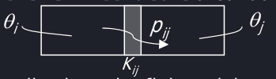

# Modellistica dei sistemi termici

Dato un corpo omoegneo ideale di capacità termica C, l'equazione che ne descrive la temperatura è $C\frac{d\theta(t)}{dt} = p(t)$, dove p è la portata di calore, $\theta$ la temperatura assoluta.

Unità: [p] = W, [$\theta$] = K, [C] = $\frac{J}{K}$

L'equazione del conduttore termico è $p_{ij}(t) = K_{ij}[\theta_i(t) - \theta_j(t)]$.

Per un corpo omogeoneo ideale non termostatato, l'equazione di stato è $C_i\dot{\theta_i}(t) = \Sigma_k p_k^{est}(t) - \Sigma_j^{j \neq i}p_{ij}^{int}(t)$, dove le portate interne hanno la forma $p_{ij}^{int}(t) = K_{ij}[\theta_i(t) - \theta_j(t)]$.