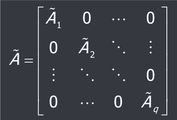

# Analisi modale
Studio delle caratteristiche del movimento libero $x_l(t)$ di un sistema dinamico lineare tempo invariante e tempo continuo di ordine n descritto dall'equazione di stato $\dot{x}(t) = Ax(t)$.

Non essendovi la parte forzata, la forma della soluzione è $x_l(t) = e^{At}x(0_-)$.

## Esempio semplice
Supponendo la matrice A puramente diagonale, con n autovalori $\lambda_1,...,\lambda_n$ reali e distinti.

Dato un sistema con tre variabili di stato $x_1, x_2, x_3$, si ha che:

$$\begin{bmatrix}\dot{x_1}\\\dot{x_2}\\\dot{x_3}\end{bmatrix} = \begin{bmatrix}\lambda_1&0&0\\0&\lambda_2&0\\0&0&\lambda_3\end{bmatrix} \cdot \begin{bmatrix}x_1\\x_2\\x_3\end{bmatrix}$$

Che si può riscrivere in forma di Lagrange:

$$\begin{bmatrix}x_1(t)\\x_2(t)\\x_3(t)\end{bmatrix} = \begin{bmatrix}e^{\lambda_1t}&0&0\\0&e^{\lambda_2t}&0\\0&0&e^{\lambda_3t}\end{bmatrix} \cdot \begin{bmatrix}x_1(0_-)\\x_2(0_-)\\x_3(0_-)\end{bmatrix}$$

I modi naturali sono quelli nella forma $e^{\lambda_it}$, ovvero quelle funzioni esponenziali associate agli autovalori.
## Introduzione

L'analisi modale è lo studio asintotico del comportamento dei modi naturali associati al sistema.

- Un modo si dice *convergente* se $\lim_{t\to\infty}|m(t)| = 0$, ed avviene quando $\lambda$ è minore di 0; 
- Un modo si dice *limitato* se $0 \le |m(t)| \le M \le \infty$, ed avviene quando $\lambda$ è uguale a 0;
- Un modo si dice *divergente* se $\lim_{t\to\infty}|m(t)| = \infty$, ed avviene quando $\lambda$ è maggiore di 0.

Si possono studiare le proprietà del movimento libero tramite la trasformazione di similarità $e^{At} = Te^{\overline{A}t}T^{-1}$, dove T è una matrice costante ed A è una matrice diagonale o diagonale a blocchi.  

Per blocchi corrispondenti a coppie di autovalori complessi e coniugati del tipo $\lambda = \sigma \pm j\omega$, la matrice $\overline{A} = \begin{bmatrix}\sigma&\omega\\\omega&\sigma\end{bmatrix}$

