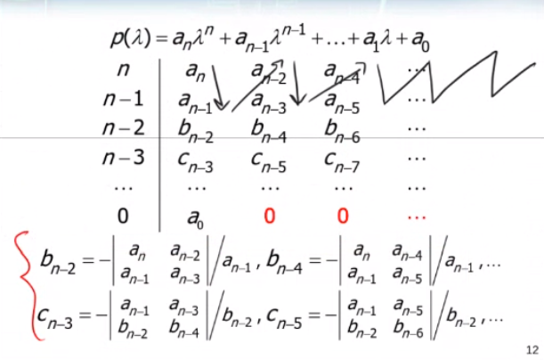

# Stabilità
Un sistema si dice stabile se è poco sensibile a perturbazioni sullo stato iniziale.
Quando si esamina lo stato del sistema $\tilde{x}$, normalmente si ricava più facilmente una versione semplificata ed approssimata dello stato $x$.
La differenza tra questi due stati, $x - \tilde{x} = \delta x$ è ciò che viene analizzato per definire la stabilità di un sistema.

Se questa $\delta x$ diverge, allora il sistema è considerato instabile. Altrimenti:

- Se $lim_{t\to\infty} \delta x(t) = 0$, allora $\tilde{x}$ è asintoticamente stabile;
- Se $lim_{t\to\infty} \delta x(t) = k$, allora $\tilde{x}$ è semplicemente stabile;
- Se $lim_{t\to\infty} \delta x(t) = 0$, per ogni $x_0$ (stato iniziale) allora $\tilde{x}$ è globalmente stabile;

Se il sistema è LTI, il sistema $\delta{x}$ non dipende da $\tilde{x}$, e quindi basta analizzare il movimento dello stato reale.

## Stabilità interna
Si parla di stabilità interna quando non esiste uno stato iniziale degenere per cui l'evoluzione dello stato è divergente.
Per determinare la stabilità interna si analizzano gli autovalori di A, tramite le seguenti condizioni di stabilità applicate a tutti gli autovalori:

| Tempo continuo | Tempo Discreto |
| --- | --- |
| $Re(autovalore) < 0$ | \| autovalore \| < 1 |

Si possono usare degli altri criteri per determinare la stabilità interna anche nei casi in cui il polinomio caratteristico è troppo difficile da scomporre, o non scomponibile.

Nel caso di tempo continuo si possono usare:

- Criterio di cartesio
- Criterio di Routh-Harwitz

Nel caso di tempo discreto invece si possono suare

- 3 disequazioni strane
- Criterio di Jury

### Criterio di cartesio
Dato $H(s) = \frac{N(s)}{D(s)}$, il cui grado del denominatore è minore o uguale a due, allora si può usare anche solo il criterio di cartesio.

Dato $D(s) = as^2 + bs + c$, il numero di variazioni di segno tra a, b e c costitiuisce il numero massimo di radici reali positive di D(s) o questo stesso diminuito di un multiplo di 2. 

Se questo è zero, ovvero a, b e c sono tutti concordi, il numero di radici reali positive è zero, quindi è stabile.

La stessa regola, applicata a D(-s), indica il numero massimo di radici reali negative.

### Criterio di Routh-Harwitz
Dato $H(s) = \frac{N(s)}{D(s)}$, il cui grado del denominatore è maggiore di due, allora si devono usare sia cartesio che Routh.

### Disequazioni strane
Dato $H(s) = \frac{N(s)}{D(s)}$, il cui grado del denominatore è minore o uguale a due, allora si può usare anche solo il criterio delle disequazioni strane.

Le tre disequazioni sono:

- $D(1) > 0$
- $(-1)^n D(-1) > 0$
- $|a_n| > |a_0|$

### Criterio di Jury

## Stabilità esterna
Si parla di stabilità esterna quando non esiste un ingresso degenere per cui la risposta forzata non diverge.

Per determinare la stabilità interna si analizzano i poli di H(s), tramite le seguenti condizioni di stabilità applicate a tutti i poli:

| Tempo continuo | Tempo Discreto |
| --- | --- |
| $Re(polo) < 0$ | \| polo \| < 1 |

!!! warning "Poli e Autovalori"

    Notare che i poli di H(s) sono un sottoinsieme degli autovalori di A. $Poles\{H(s)\} \in Eig\{A\}$.
    Si ha quindi l'implicazione che stabilità interna implica stabilità esterna, ma la stabilità esterna implica la stabilità interna **solo se** il sistema è in forma minima.
    Questo avviene in quanto la risposta di un sistema in forma minima non dipende dalla risposta libera.

    Nel caso in cui il sistema sia in forma minima, allora l'insieme dei poli collide completamente con l'insieme degli autovalori.
    Solo e solamente in questo caso, è possibile utilizzare i criteri avendo i poli del sistema ma non gli autovalori per ricavare la stabilità interna.
    