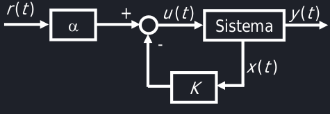

# Retroazione
## Retroazione statica dello stato
Dato un sistema SISO, è possibile regolare il comportamento del sistema tramite uno schema di componenti esterni al sistema stesso. Si utilizza un componente detto "controllore" per inviare un ingresso specifico che "forzi" il  sistema verso ciò che vogliamo ottenere nell'andamento desiderato di y.

Il controllore prende in ingresso lo stato corrente dalla retroazione e ti sputa in faccia.
Si può costriuire una legge di controllo soltanto se il sistema è completamente raggiungibile.

Partendo da un ingresso $u(t) = \alpha r - kx(t)$, ed applicandolo alla legge di stato dei sistemi LTI, si ha che: 

$$\dot{x} = Ax + B(\alpha r - Kx) = (A - BK)x + \alpha B r$$

$$y = Cx + Du = (C - DK)x + \alpha D r$$

Come primo passo è necessario progettare la matrice dello stato $(A - BK)$ in modo tale da avere il comportamento asintotico richiesto.

Per fare ciò si impone il polinomio caratteristico di $(A - BK) = \Pi_i (\lambda - \lambda_i)$ per trovare il vettore incognito K.

Per trovare $\alpha$ si usa la formula nota $\alpha = [-(C-DK)(A-BK)^{-1}B+D]^{-1}$. Perché? Perché te lo dico io!

## Raggiungibilità
Non tutti gli stati non sono raggiungibili, a prescindere dall'ingresso.
Uno $x_1$ stato è **raggiungibile** da uno stato iniziale $x_0$ se esiste un ingresso *u* che mi permette di arrivare ad $x_1$.

Per i sistemi **completamente raggiungibili**, esiste sempre un ingresso *u* che ti porti ad uno stato $x_1$.

Per controllare che un sistema sia completamente raggiungibile, si crea la **matrice di raggiungibilità** $M_R = \begin{bmatrix}B&AB&...&A^{n-b}B\end{bmatrix}$, dove b è il rango di B (nei casi SISO è 1), e si controlla che abbia il rango massimo. Per controllare il rango, si dovrebbe controllare che la matrice non abbia righe dipendenti, ma si può sfruttare una proprietà dell'algebra lineare per cui, se il determinante è nullo, allora la matrice non può avere rango massimo, dunque il modo più semplice è calcolare il determimante della matrice di raggiungibilità.

## Osservabilità
Uno stato iniziale $x_0$ è osservabile a partire da $y$ se esiste una relazione matematica che mi permette di ricavarlo a partire da $y$.

Si verifica che un sistema è **completamente osservabile** se la matrice di osservabilità $M_0 = \begin{bmatrix}C\\CA\\...\\CA^{n-1}\end{bmatrix}$ è di rango massimo (determinante diverso da zero).

Per determinare L dello stimatore vai a fare in culo e forzi che il polinomio caratteristico di $(A - LC)$ sia uguale a $\Pi_i (\lambda - \lambda_i)$, avendo L come unica variabile incognita.