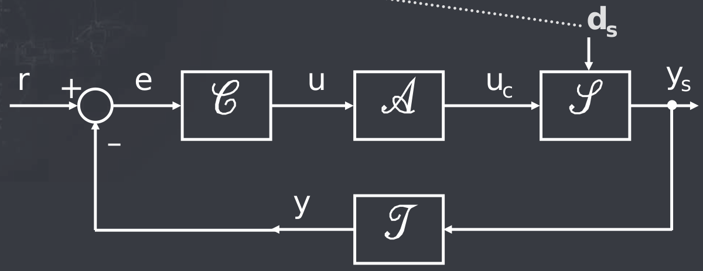
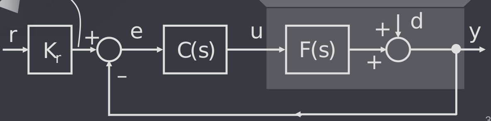
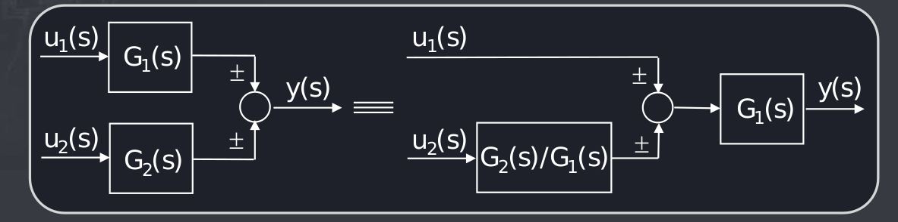
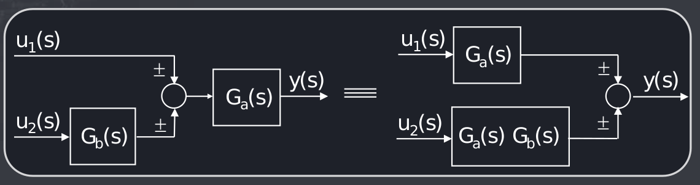
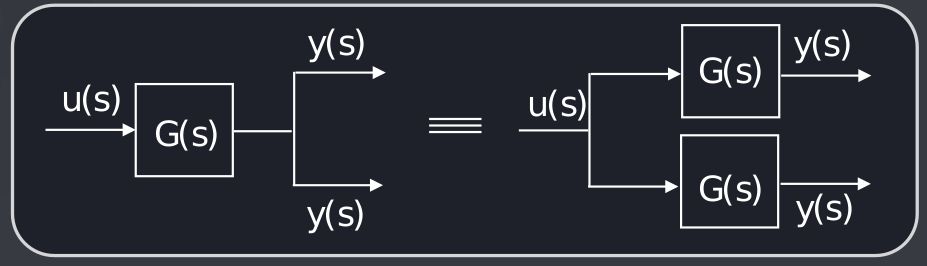
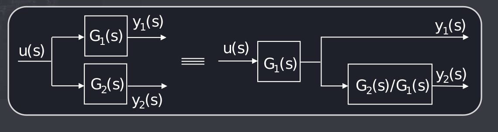
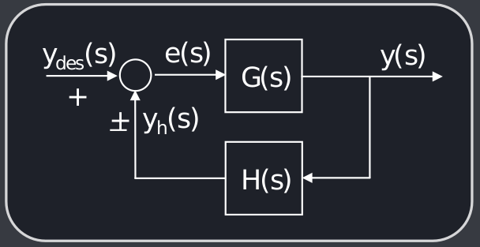

# Introduzione ai sistemi di controllo
Fino ad ora abbiamo analizzato lo stato del sistema, l'ingresso e l'uscita, adesso dello stato non ce ne frega più un cazzo e analizziamo solo il rapporto tra ingresso e uscita, che bello.

Se prima si doveva stimare lo stato per mandarlo in retroazione insieme all'uscita, adesso mandiamo solo l'uscita in retroazione, fico.

Il **sistema** prendere un segnale di comando e dei disturbi e ne fa uscire una $y_s$ uscita del sistema; l'**attuatore** prende l'ingresso $u$ e ne fa uscire il segnale di comando; il **trasdtuttore** misura l'uscita $y_s$ e la misura, producendo $y$, che va in retroazione negativa e viene confrontato con il **riferimento** r, e ne esce l'errore tra il riferimento e l'uscita misurata; il **controllore** crea un u che cerca di minimizzare l'errore.

Normalmente si uniscono attuatore, trasduttore e sistema in un blocco unico con una F(s):

Questa parte del corso si occuperà di progettare il controllore.

Blocchi in parallelo si sommano, mentre quelli in cascata si moltiplicano.

## Spostamento rispetto ad un sommatore

## Spostamento rispetto ad un punto di derivazione

## Funzione di trasferimento di un anello

La funzione di trasferimento di un anello è $\frac{G(s)}{1\pm G(s)H(s)}$.