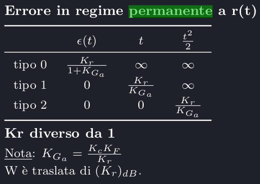
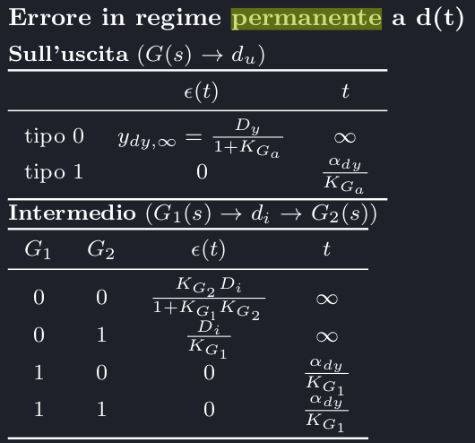

# Specifiche di progetto
Le specifiche di progetto definiscono il modo in cui l'uscita deve inseguire il riferimento. Le principali specifiche di progetto riguardano:

- La stabilità del sistema controllato (è la cosa più importante)
- La robustezza della stabilità del controllo
- Specifiche di progetto in regime permanente 
- La precisione dell'inseguimento (errore in regime permanente)
- La capacità di spondere in maniera ottimale ai disturbi, minimizzandone gli effetti
- La forma della risposta di sistema durante il transitorio (sovraelongazione massima, tempo di salita e tempo di assestamento)
- Reiezione dei disturbi (polinomiali o sinusoidale)
- Risposte in frequenza (banda passante e picco di risonanza)

## Robustezza di stabilità
Per analizzare la robustezza di stabilità si inizia analizzando il grafico di F(s). Si usano i seguenti grafici:

 - Diagramma di bode (Modulo in db / pulsazione $\omega$ in decadi)
 - Diagramma polare (Rappresentazione Im / Re dei complessi)
 - Diagramma di Nyquist 
 - Diagramma di Nichols
  
Si possono trovare fase iniziale e finale come:

$$\begin{matrix}\varphi_0 = -90\cdot n_{integratori} + \angle K\\\varphi_f = \varphi_0 - 90\cdot (P_{np} + Z_p) + 90\cdot(P_p - Z_{np})\end{matrix}$$.

!!!note
    Per non positivi si intende i poli con parte reale non positiva esclusa l'origine. Gli integratori sono i poli in zero.

!!!note "K"
    K è il guadagno stazionario della funzione F, e si trova come $K = \lim_{s\to 0} s^{n_{integratori}}\cdot F(s)$, ovvero si tolgono gli integratori dalla funzione. Su matlab, si può calcolare come `dcgain(s^n*F)`.

    K è un numero reale quindi ha fase o 0, o -180, o 180.

    | K | Fase |
    | - | ---- |
    | >0 | 0 |
    | <0 | $\pm$180 |

Il criterio di Nyquist dice che, preso il punto (-1, 0) detto **punto critico di nyquist**, e N definito come numero dei giri orari meno numero dei giri antiorari attorno al PCN, se N è pari al numero di poli instabili della catena chiusa meno il numero di poli instabili della catena aperta, allora F(s) è stabile.

$$\begin{matrix}N = \text{n giri orari - n giri antiorari attorno a }(-1, 0)\\N_0 = n_{i,c} - n_{i,a}\\\text{Se }N = N_0\text{, F stabile.}\end{matrix}$$

## Margini di stabilità
I margini di stabilità sono dei limiti oltre il quale il sistema non è stabile. Sono:

- Margine di guadagno
- Margine di fase

### Margine di guadagno
Col diagramma di nyquist si arriva ad uno stato in cui si hanno diverse circonferenze attorno al punto critico, che potrebbe trovarsi in una zona stabile o no. Se esiste una zona stabile, e se il punto critico si trova in una zona instabile, si può progettare un controllore con un guadagno $K_c$ tale per cui il raggio delle circonferenze si allarga a tal punto da inglobare anche il punto critico nell'area stabile.

Il guadagno minimo necessario perché ciò avvenga è definito **margine di guadagno**.

Quindi avendo uno o più set $(R_A, R_B)_i$ in cui il sistema è stabile, si ragiona al contrario e si imposta il  punto critico come $(-\frac{1}{m_g}, 0)$ e si scala $m_g$ fino a far rientrare il punto critico all'interno del range stabile. 

Bros puoi vederlo da bode guardando per quali valori di s (in db) il diagramma della fase tocca -180°, e facendo cross referencing con la distanza nel diagramma del modulo rispetto a y = 0dB.

### Margine di fase
Bros è la stessa cosa ma controlli per quali valori di s (in db) il diagramma del modulo tocca 0, e facendo cross referencing con la distanza nel diagramma della fase rispetto a -180*. In questo caso, se ce ne stanno più di uno, si usa il margine più piccolo rispetto a -180.

### Picco di risonanza
Data la catena chiusa $W = \frac{G_a}{1 \pm G_a}$  o su matlab `feedback(C*F, 1/Kr)`, il picco di risonanza è il valore massimo ottenuto dal diagramma di bode del modulo della funzione di trasferimento del sistema $M_R = max(|W(j\omega|)$.

Per controllare che il sistema non tocchi mai il picco di risonanza si considerano le circonferenze presenti nel diagramma complesso, se il diagramma di nyquist non tocca mai la circonferenza dei db di risonanza allora non tocca mai il picco di risonanza.

## Errori
### Errore di inseguimento
L'errore di inseguimento è lo scarto che c'è tra il riferimento e l'uscita del sistema, che può convergere o divergere $e_{\infty} = y - r$
L'errore di inseguimento si può compensare aggiungendo integratori sul controllore.

### Disturbi

