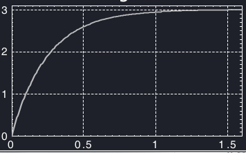

# Esercizi esame
Dato $H(s) = \frac{K}{1+\tau s}$, determinare i parametri K e $\tau$ in modo tale che la sua risposta ad un gradino di ampiezza unitaria sia quella illustrata in figura.



Dato che $Y = K \cdot u = 3$ e $u = 1$, allora $K = 3$. Poi si può usare il tempo di salita si ha che $0.95 y = 2.85$, quindi applicando alla formula di H(s) si ricava che $\tau = \frac{0.75}{3} = 0.25s$.

``` matlab
s = tf('s'); % Crea funzione di trasferimento.
H1 = 1/(s + 10); % definisci funzione di trasferimento.
impulse(H1); % mostra la risposta all'impulso.
step(H1); % mostra la risposta al gradino.
grid on; % mostra la griglia.
ltiview; % mostra il sistema dinamico lti.
```

``` matlab
s = tf('s');


```